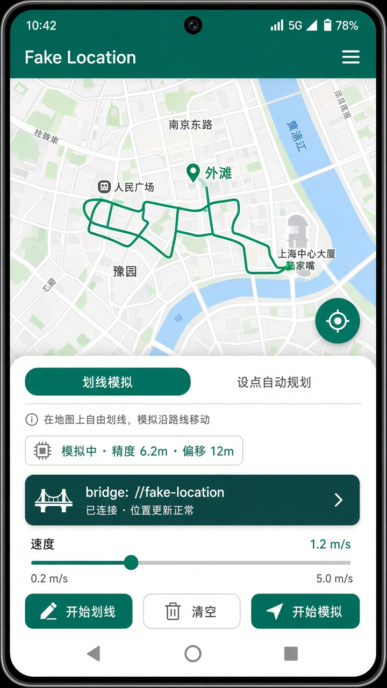
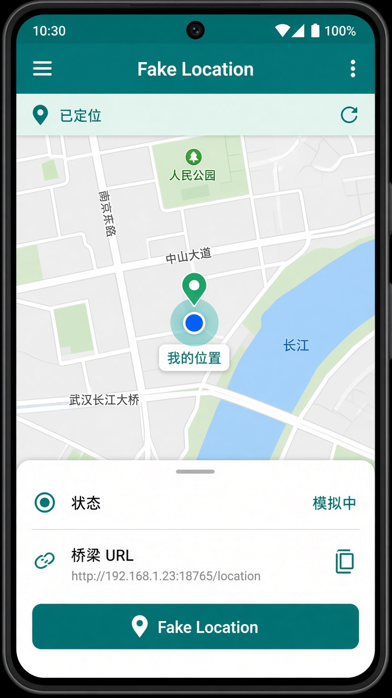
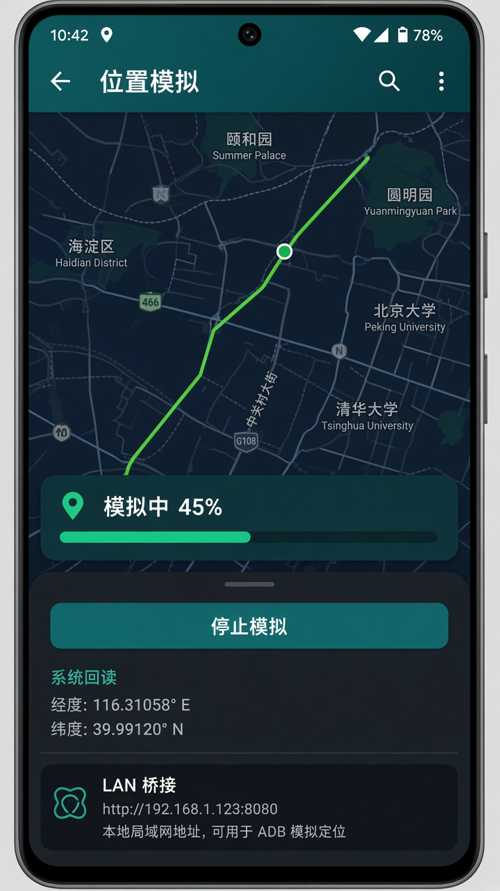

# Fake Location

Android 虚拟定位与轨迹模拟工具（Kotlin）。支持手指划线规划路线、自动路径规划、系统 Mock Location，以及可选的局域网桥接供**自有小程序开发联调**使用。

> **重要限制**：微信小程序的 `wx.getLocation` 由微信客户端提供。实测中百度地图可跟随模拟点，高德/腾讯系常会很快改回真位置或忽略 Mock。  
> **不改小程序代码时，无法保证影响微信小程序定位。** 本项目仅供学习、自有业务测试，禁止用于虚假打卡、欺诈或任何违法用途。

## 界面预览

> 下图为界面示意（UI mockup）。你可自行替换为真机截图：`docs/screenshots/`。

| 主界面 / 划线 | 定位到我 | 模拟运行中 |
| --- | --- | --- |
|  |  |  |

## 功能

- **划线模拟**：手指在地图上画出轨迹，按设定速度沿路线推进  
- **设点自动规划**：起终点 + OSRM 步行路径（演示用公网服务）  
- **定位到我**：获取真实位置并在高德底图（GCJ-02）上居中  
- **系统 Mock Location**：向 GPS / NETWORK / fused 写入模拟坐标  
- **账号安全护栏**：须知确认、速度上限、会话时长、停止后提醒  
- **局域网桥接**（可选）：`http://<手机局域网IP>:18765/location`，供自有小程序开发模式拉取坐标（需改小程序，见 `miniprogram-bridge/`）

## 环境要求

- Android Studio Ladybug / 较新稳定版  
- JDK 17  
- Android 设备或模拟器，**minSdk 26**  
- 真机使用 Mock 时需开启**开发者选项**

## 快速开始

```bash
git clone https://github.com/<your-name>/fakelocation.git
cd fakelocation
```

用 Android Studio 打开工程，连接真机，点击 Run。

### 启用模拟位置（真机）

1. 设置 → 关于手机 → 连续点击版本号，打开开发者模式  
2. 开发者选项 → **选择模拟位置信息应用** → 选本 App  
3. 打开 App → 划线或规划 → **开始模拟**  
4. 用百度/高德等验证系统坐标是否变化（结果因 App 而异）  
5. 测完后**停止模拟**，并取消「模拟位置信息应用」

### 判断是「系统 Mock 生效」还是「微信丢弃」

1. 开始模拟后看 App 内「系统回读」是否有坐标  
2. 打开**百度地图**：若蓝点在模拟点 → 系统 Mock 基本成功  
3. 打开**高德**：可能先闪假点再回到真点（融合定位）  
4. 再测微信小程序：若系统侧已是假点、小程序仍是真点 → 微信未采用 Mock  

## 工程结构

```
fakelocation/
├── app/                         # Android 应用
│   └── src/main/java/com/fakelocation/app/
│       ├── mock/                # MockLocationService / Writer
│       ├── map/                 # 瓦片源、划线 Overlay
│       ├── bridge/              # 局域网 HTTP 位置服务
│       ├── location/            # 「定位到我」
│       ├── geo/                 # WGS-84 ↔ GCJ-02
│       └── ui/                  # MainActivity
├── miniprogram-bridge/          # 可选：小程序 LocationProvider 示例
└── docs/screenshots/            # README 配图
```

## 可选：小程序开发桥接

若你**可以改自己的小程序**（仅开发联调），可使用：

- `miniprogram-bridge/location-provider.js`  
- 微信开发者工具勾选「不校验合法域名」  
- App 内「复制桥接地址」填入 `BRIDGE_URL`  
- 正式发布前设 `USE_BRIDGE = false`

不改小程序则无需使用该目录。

## 技术说明

| 项 | 说明 |
| --- | --- |
| 语言 | Kotlin |
| 地图 | osmdroid + 高德瓦片（国内）/ GeoQ 备用 |
| 坐标 | 地图展示 GCJ-02；写入系统默认转 WGS-84 |
| Mock | `LocationManager` Test Provider |
| 桥接 | 本机 `ServerSocket` HTTP `:18765` |

## 合规与免责

- 仅用于学习与**自有应用**功能测试  
- 禁止用于虚假打卡、骗取基于位置的权益、侵犯他人隐私等  
- 不提供、不实现隐藏 mock 标记或绕过微信/应用风控的能力  
- 使用本软件造成的账号限制、封禁或其他后果由使用者自行承担  

## License

[MIT](LICENSE)
